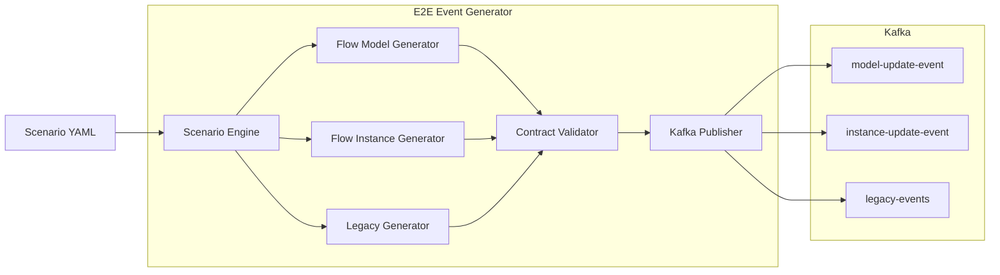

# E2E Event Generator — POC

Отдельный Kotlin-модуль для POC End-to-End мониторинга в BAMN.

Модуль эмулирует:
- Flow `ProcessModelEvent` и отправляет его в отдельный Kafka topic моделей;
- Flow `ProcessInstanceEvent` и отправляет его в отдельный Kafka topic экземпляров;
- сообщения Legacy АС в формате, совместимом с `ProcessInstanceEvent`, в отдельный Kafka topic;
- normal / delay / missing / retry / duplicate / ambiguous / invalid-contract сценарии.

Генератор не формирует `E2E_ID`: это ответственность BAMN Correlation Engine.

## Зафиксированный baseline BAMN

Все версии взяты из `versions.md`:

- Java 11, JVM target 11
- Kotlin 1.4.32
- Spring Boot 2.4.5
- Spring Framework 5.3.6
- Spring Kafka 2.7.0
- Kafka Clients 3.0.0
- Jackson 2.12.3
- CloudEvents 2.0.0
- JUnit Jupiter 5.8.0-M1
- SpringMockK 3.1.0
- Micrometer Prometheus 1.6.6
- Logstash Logback Encoder 6.6
- Gradle 6.8
- Spotless 5.12.4
- ktlint 0.41.0
- Detekt 1.16.0
- Jacoco 0.8.7
- SonarQube plugin 3.3

Нельзя автоматически обновлять эти версии в Cursor.

## Flow contract

Основной источник: `docs/reference/Flow_contract.pdf`.

Контракт:
- Platform V Flow 5.5.0;
- AsyncAPI 3.0.0;
- `ProcessModelEvent` -> `model-update-event`;
- `ProcessInstanceEvent` -> `instance-update-event`;
- common Kafka/CloudEvents headers:
  - `ce_type`
  - `ce_source`
  - `ce_specversion`
  - `ce_time`
  - `ce_id`

## Архитектура



## Сборка

Требуется Java 11.

Рекомендуемый способ — Gradle Wrapper 6.8.

```bash
./gradlew clean check bootJar
```

Результат:

```text
build/libs/e2e-event-generator.jar
```

Если wrapper ещё не создан, см. `gradle/wrapper/README.md`.

## Запуск JAR

Подробно: [`docs/RUN_AND_CONFIG.md`](docs/RUN_AND_CONFIG.md) — все параметры, env, сценарии и примеры.

```bash
java -jar build/libs/e2e-event-generator.jar \
  --generator.command=run \
  --generator.scenario=full-poc
```

Kafka:

```bash
export KAFKA_BOOTSTRAP_SERVERS=localhost:9092
export FLOW_MODEL_TOPIC=model-update-event
export FLOW_INSTANCE_TOPIC=instance-update-event
export LEGACY_TOPIC=legacy-events

java -jar build/libs/e2e-event-generator.jar
```

## Docker

Dockerfile намеренно не фиксирует публичный vendor image. Перед сборкой передаются утверждённые внутренние Java 11 images.

```bash
docker build \
  --build-arg BUILD_JDK11_IMAGE=<approved-jdk11-image> \
  --build-arg RUNTIME_JRE11_IMAGE=<approved-jre11-image> \
  -t e2e-event-generator:0.1.0 .
```

Запуск:

```bash
docker run --rm \
  -e KAFKA_BOOTSTRAP_SERVERS=kafka:9092 \
  -e FLOW_MODEL_TOPIC=model-update-event \
  -e FLOW_INSTANCE_TOPIC=instance-update-event \
  -e LEGACY_TOPIC=legacy-events \
  -e FLOW_MODEL_CE_TYPE=<confirmed-value> \
  -e FLOW_INSTANCE_CE_TYPE=<confirmed-value> \
  -e FLOW_CE_SOURCE=<confirmed-value> \
  -e LEGACY_INSTANCE_CE_TYPE=<poc-value> \
  -e LEGACY_CE_SOURCE=<poc-value> \
  e2e-event-generator:0.1.0
```

## Важно по CloudEvents

Flow contract определяет имена headers, но предоставленный документ не фиксирует подтверждённые production-значения для `ce_type`, `ce_source` и `ce_specversion`.

Поэтому значения вынесены в конфигурацию и должны быть заполнены из реальных примеров/настроек Flow перед интеграционным тестированием.

## Сценарии

- `happy-path.yml`
- `full-poc.yml`
- `negative.yml`
- `load-smoke.yml`

`seed` делает логические IDs и correlation data воспроизводимыми.

## Cursor

Правила находятся в `.cursor/rules/`.

Основное правило: Cursor не должен предлагать Java 17/21, Kotlin 2.x, Spring Boot 3.x или новые версии Kafka/Jackson.

Подробный порядок разработки: `docs/IMPLEMENTATION_PLAN.md`.
