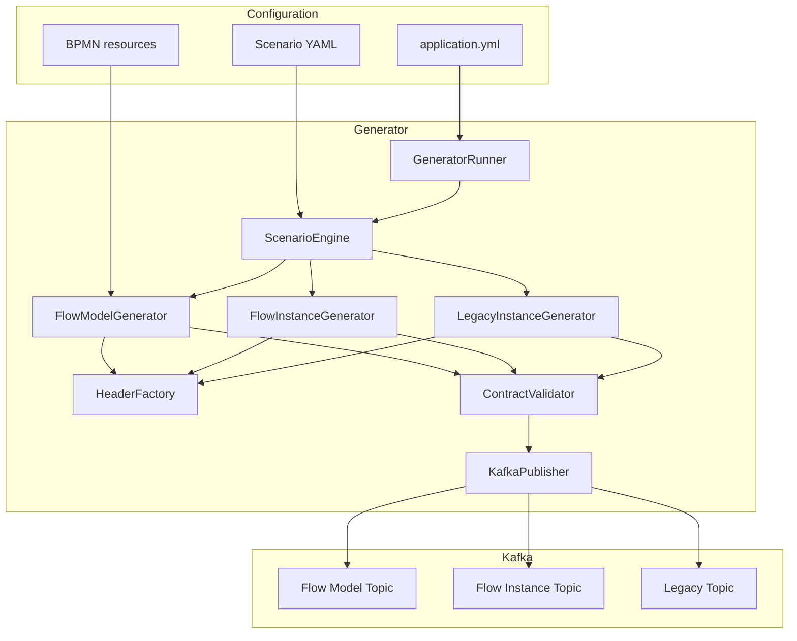

# Архитектура генератора

## Границы

Generator:
- не зависит от BAMN source code;
- не пишет в PostgreSQL;
- не обращается к ABYSS;
- не вычисляет E2E_ID;
- не исполняет BPMN.

Generator создаёт только входную телеметрию для POC.
