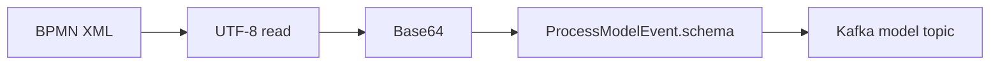
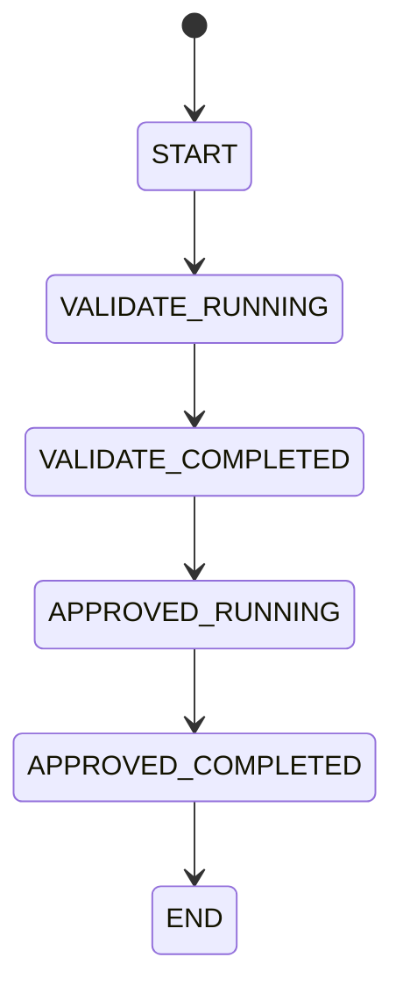

# План реализации E2E Event Generator

## 1. Назначение

Создать отдельный генератор POC, не являющийся runtime-компонентом BAMN.

Генератор должен:
1. Генерировать Flow-модели.
2. Генерировать последовательные snapshot-события Flow instances.
3. Генерировать Legacy events по тому же `ProcessInstanceEvent`-совместимому контракту.
4. Публиковать три потока в разные Kafka topics.
5. Формировать согласованные business/correlation values между Process A, Legacy и Process B.
6. Поддерживать batch и continuous режимы.
7. Собираться в standalone fat JAR.
8. Запускаться тем же JAR в Docker.

## 2. Зафиксированные версии

| Компонент | Версия |
|---|---:|
| Java | 11 |
| Kotlin | 1.4.32 |
| Spring Boot | 2.4.5 |
| Spring Framework | 5.3.6 |
| Spring Kafka | 2.7.0 |
| Kafka Clients | 3.0.0 |
| Jackson | 2.12.3 |
| CloudEvents | 2.0.0 |
| JUnit Jupiter | 5.8.0-M1 |
| SpringMockK | 3.1.0 |
| Micrometer Prometheus | 1.6.6 |
| Logstash Logback Encoder | 6.6 |
| Gradle | 6.8 |
| Spotless | 5.12.4 |
| ktlint | 0.41.0 |
| Detekt | 1.16.0 |
| Jacoco | 0.8.7 |
| SonarQube | 3.3 |

Источник: `docs/reference/versions.md`.

## 3. Этапы

### Этап 1 — Bootstrap

Создать Kotlin/Spring Boot Gradle-проект на Java 11.

Критерии:
- `jvmTarget=11`;
- Kotlin 1.4.32;
- Gradle 6.8;
- Spring Boot 2.4.5;
- jar называется `e2e-event-generator.jar`.

### Этап 2 — Contract layer

Реализовать DTO:
- `ProcessModelEvent`
- `ProcessInstanceEvent`
- `NodeInstance`
- `RetryInstance`
- `RetryPolicyModel`
- `Policy`
- `Operation`
- `ErrorInfo`
- `MaskPatternItem`
- `MaskPatternOptions`
- common CloudEvents headers.

Принципы:
- required и non-null — разные понятия;
- nullable required property сериализуется как `"field": null`;
- `variables` поддерживает произвольный nested JSON;
- process state и node state — разные enums.

### Этап 3 — Flow Model Generator

Ресурсы BPMN лежат в `src/main/resources/bpmn`.

Pipeline:



Model event отправляется только в topic моделей.

### Этап 4 — Flow Instance Generator

Один instance формирует несколько snapshots одного `id`.



У каждого snapshot:
- тот же instance `id`;
- новый `ce_id`;
- обновлённые `nodeInstances`;
- актуальные `startDate/endDate/state`.

### Этап 5 — Legacy Generator

Legacy использует тот же DTO `ProcessInstanceEvent`.

Это соглашение POC, не утверждение о production Legacy/COTE contract.

Отличаются:
- topic;
- `ce_source`;
- logical process/module IDs;
- node names;
- correlation variable.

Для Legacy не генерируется `ProcessModelEvent`, пока это отдельно не потребуется.

### Этап 6 — Scenario Engine

Scenario хранится в YAML, бизнес-сценарий не зашивается в Kotlin.

Обязательные режимы:
- happy;
- delayed target;
- missing target;
- retry;
- failed;
- duplicate `ce_id`;
- ambiguous key;
- invalid contract.

### Этап 7 — Kafka Publisher

Kafka record:
- key model event = `processDefinitionId`;
- key instance event = `id`;
- payload = JSON;
- CloudEvents metadata = Kafka headers.

Topic names — только через configuration/env.

### Этап 8 — Validation

Normal mode:
- не публиковать невалидный event;
- validation error завершает/помечает сценарий.

Negative mode:
- намеренная отправка invalid event разрешена только для явного negative case.

### Этап 9 — Tests

Unit:
- enums;
- IDs;
- Base64 BPMN;
- serialization;
- lifecycle;
- deterministic seed.

Contract:
- fixtures из Flow contract;
- deserialize -> serialize -> semantic compare.

Kafka:
- Spring Kafka Test / Embedded Kafka 2.7.0;
- проверить topic, key, headers, payload.

Testcontainers не входит в baseline, так как его версия отсутствует в `versions.md`.

### Этап 10 — Packaging

```bash
./gradlew clean check bootJar
java -jar build/libs/e2e-event-generator.jar
```

Docker запускает тот же JAR на Java 11.

## 4. Критерии готовности

1. Java 11.
2. Kotlin 1.4.32.
3. Gradle 6.8.
4. Flow Model и Instance topics разделены.
5. Legacy topic отдельный.
6. Flow DTO соответствуют `Flow_contract.pdf`.
7. `variables` поддерживает nested JSON.
8. Minimum 10 instances каждого Flow process.
9. Generator не формирует `E2E_ID`.
10. Есть deterministic seed.
11. Есть batch и continuous режимы.
12. Есть happy и negative сценарии.
13. Сборка standalone JAR.
14. Сборка Docker image.
15. Cursor не обновляет версии автоматически.
